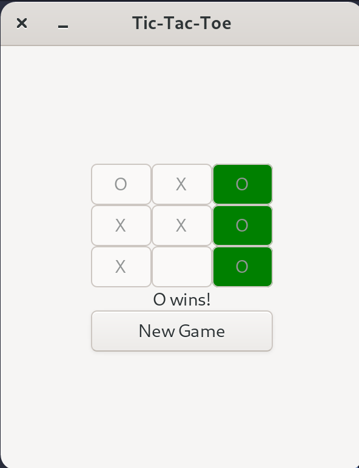

## Tic Tac Toe

Little game programmed in C with the GTK library for the graphical interface.

### Resources

[GTK 3.0](https://docs.gtk.org/gtk3/index.html)

### Commands

**compile**

```
gcc -o tictactoe tictactoe.c `pkg-config --cflags --libs gtk+-3.0`
```

**run**
`./tictactoe`

**Visuals**

